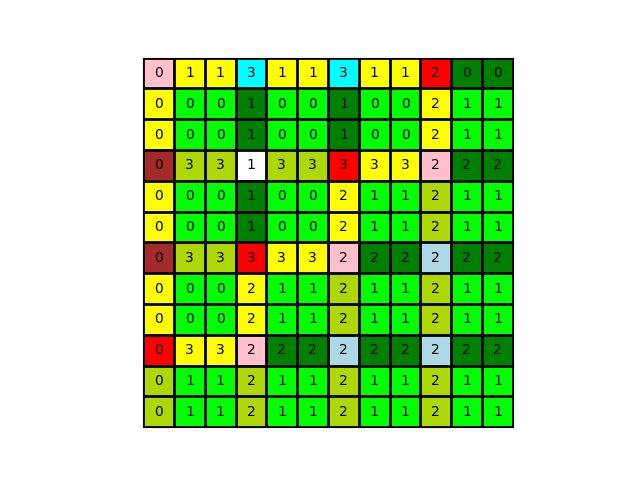

# インストール手順
1. cloneする
2. keyword/ ディレクトリに "subcell_all_v3.k" ファイルを置く
3. 以下のコマンドを実行し、submoduleのインストール＆Fortranモジュールのコンパイル
```#bash
./setup.sh
```
なお、Pythonライブラリは以下を使用。
- os
- sys
- numpy
- ctypes
- matplotlib

必要に応じてインストールしてください。

# プログラム実行手順、run.shの仕様
run.shの実行で対話形式で各種プログラムを実行します。bashで実行すると以下が表示
```
./run.sh

<select program>

1 → 与えられた.kファイルからmonolis形式のメッシュ(block)を作成

2 → monolis形式のsubcell読み取り & map情報の作成 & meso meshの作成

3 → 生成されたmeso meshのVTKファイル作成

99 → map情報作成のテスト実行 & 作成されたmap情報をグリッドへ可視化

プログラムの選択 :
```
任意のプログラム番号を入力、実行するとそれぞれに対応したプログラムがスタート。

## 1 → 与えられた.kファイルからmonolis形式のメッシュ(block)を作成
keyword/ に置いたkファイル（"subcell_all_v3.k"）から、monolis形式の入力ファイルを生成。

各サブセルがmonolis形式で出力される。（出力先： "subcell_all_monolis_v3/"）

## 2 → monolis形式のsubcell読み取り & map情報の作成 & meso meshの作成
１番のプログラムの実行後、生成されたmonolis形式の各サブセルメッシュから、任意のテープ数のmonolis形式のメゾメッシュを生成する。
```
プログラムの選択（対応する整数値を入力） : 2

meso mesh におけるテープ数 p の入力 (2以上) : p =
```
テープ数５くらいだと5~6分かかる。
## 3 → 生成されたmeso meshのVTKファイル作成
２番のプログラムで生成されたmonolis形式のメゾメッシュからParaview可視化用のVTKファイルを出力する。（出力先： ""）
## 99 → map情報作成のテスト実行 & 作成されたmap情報をグリッドへ可視化
このプログラムはテスト用プログラムのため、直接メゾメッシュ生成プログラムには影響しない。

以下のように、各サブセルがどのように配置されるかのmap情報を可視化する。

**＜p=4の例＞**

